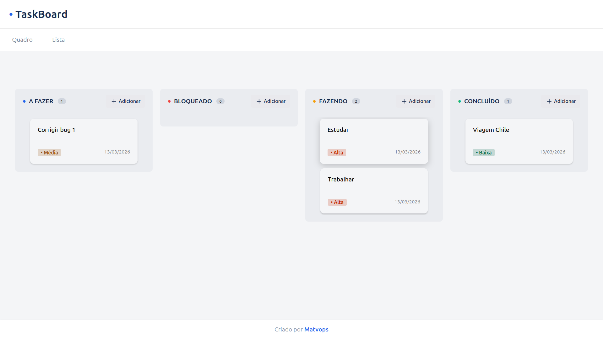

# Simple Taskboard

[](https://react.dev)
[](https://www.typescriptlang.org)
[](https://vitejs.dev)

## Um kanban de aprendizagem feito com React + TypeScript

 **Simple Taskboard** é um projeto pessoal desenvolvido para estudo e portfolio. Ele é um Kanban interativo que combina boa usabilidade com um código simples, moderno e fácil de evoluir.

<picture>
  
</picture>

## Por que este projeto?

Este app nasceu como um exercício prático para consolidar o conhecimento em:

- React moderno com componentes funcionais
- TypeScript tipado e seguro
- gerenciamento de estado com Context API
- navegação com React Router
- experiência de usuário com drag-and-drop
- persistência leve via `sessionStorage`

Ele também é uma aplicação ideal para o meu portfólio, pois tem interface acessível e fácil de estender.

## Funcionalidades principais

- 🎯 Quadro Kanban com colunas: **A Fazer**, **Bloqueado**, **Fazendo** e **Concluído**
- 🧲 Suporte a drag-and-drop com `@hello-pangea/dnd`
- ➕ Criação de tarefas por coluna com modal
- 📊 Visualização opcional em tabela com todas as tarefas
- 🔁 Persistência de dados na sessão do navegador (não é backend)
- 🌐 Rotas simples para separar views e melhorar a navegação

## Rotas disponíveis

- `/` — Quadro Kanban
- `/lista` — Tabela de tarefas
- `/autor` — Página do autor com links de contato

## Stack usada

- React 19
- TypeScript 5
- Vite
- React Router 7
- @hello-pangea/dnd
- lucide-react
- ESLint

## Como executar localmente

```bash
npm install
npm run dev
```

Abra o endereço exibido pelo Vite no navegador e comece a usar o app.

## Estrutura do projeto

- `src/App.tsx` — configura o contexto e roteamento
- `src/contexts/TasksContext/TaskContextProvider.tsx` — estado global e sincronização com sessionStorage
- `src/components/Steps` — lógica do quadro Kanban e drag-and-drop
- `src/components/Table` — visualização de tarefas em tabela
- `src/components/ModalCreateTask` — interface de criação de tarefas
- `src/routers/MainRouter.tsx` — container de rotas
- `src/templates/MainTemplate` — layout com header e footer
- `src/pages/Board` / `src/pages/List` / `src/pages/Author` — views principais

## Pontos de diferenciação

- Design focado em usabilidade e clareza
- Uso de contexto para gerenciar estado entre páginas
- Conversão de timestamps para datas legíveis com utilitário próprio
- Tarefas concluídas filtradas por prazo para manter o histórico recente

## Próximos passos

Este projeto pode evoluir com:

- edição e exclusão de tarefas
- filtros por prioridade e data

## Sobre o autor

Criado por **Matvops / Matheus Cadenassi** como parte do portfólio de front-end.

Visite o perfil no GitHub e no LinkedIn pela página `/autor`.

---

> Um projeto de estudo para colocar em prática React, TypeScript e UX de gerenciamento de tarefas.